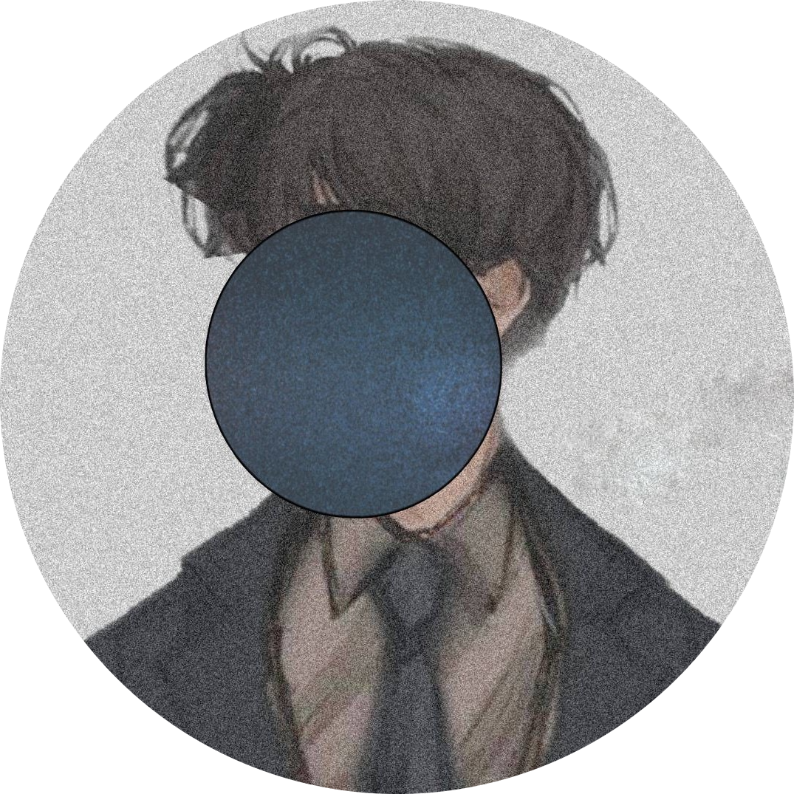

</svg>

<h1 align="center">
   ✨ Apsan ✨
</h1>

 

<h2>
  About Me
</h2>

    Exceling in the field of Computer Science and Information Technology, I am a student of Herald College Kathmandu. I am a passionate programmer and a software developer. I am a quick learner and a team player. I am always eager to learn new things and to come up with new ideas.

    
## Professional Experience 🏢

### Front-End Developer at
#### One Loop Studio, Lalitpur, Nepal
- Web Development

###  Web Manager at 
#### K. Anil Trading Company , Cambodia/ Nepal
- [Check Out Here](https://www.kaniltrading.com.kh)
- and Infrastructure Visualizer for largest workshop.

###  Managing Director at 
#### SG Driving Center , Kathmandu, Nepal
- [Check Out Here](https://www.siddhiganeshdrivingcenter.com.np)
- Supervise the official, social media and online presence work.

- I’m currently working on Web-Development and various other platforms sharpening my skills.

-  I’m passively collaborating on Open Source Projects and contributing to the community. 

   

<h2>
Templates
</h2>

### [Virtual Reality](https://virtual-reality-website.onrender.com)

### [Finance](https://demo-finance-web.onrender.com)

- 📫 How to reach me: [LinkedIn](https://www.linkedin.com/in/apsan/), apsanrana61@gmail.com

#

 

   
   
   

